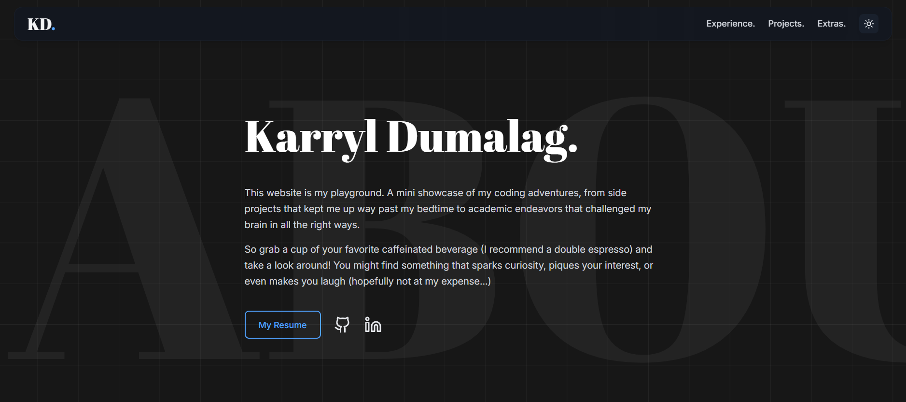

# My Portfolio

<p align="center">
    
</p>

This is my personal portfolio website, built with **React**, and **Tailwind CSS**, and deployed through **GitHub Pages**! I come back every once in a while when I'm bored and have an idea I want to play around with. 

Check it out [here](https://kayejd.github.io/)!

## Setup & Development

Clone this repository and install dependencies:

```
git clone https://github.com/KayeJD/KayeJD.github.io.git
cd KayeJD.github.io
npm install
```
 
### Quick local build
```
npm run dev
```


## Notes:

<details> <summary>🧭 Developer Reference — Setup, Deploy, & Maintenance</summary>
A quick reference guide for rebuilding, redeploying, or fixing issues with the KayeJD Portfolio project because life is simpler when I keep notes to just copy and paste from :)

1. Run these commands from the project’s root directory.
2. Currently builds the project in SPA mode and pushes the output to the gh-pages branch.
3. If the GitHub Pages site fails to load or shows outdated content, try the cleanup section, then redeploy.

## Environment Setup
### Install NVM (Node Version Manager) and Node.js v22, then update npm. Ensures consistent build/deploy versions across environments.
```
curl -o- https://raw.githubusercontent.com/nvm-sh/nvm/v0.40.3/install.sh | bash
source ~/.nvm/nvm.sh
nvm install 22
npm i -g npm@11.6.
```

## Repository & Deployment
### Verify remote configuration and deploy the site to GitHub Pages.
```
git remote set-url origin git@github.com:KayeJD/KayeJD-portfolio.git
npm run deploy
```

## Cleanup & Rebuild (if deployment or builds fail)
### Removes stale branches, cached builds, and reinstalls dependencies cleanly.
```
git fetch --prune
git branch -D gh-pages 2>/dev/null || echo "No local gh-pages branch to delete"
rm -rf build dist .cache node_modules/.cache
npm install
```

</details>

<details> <summary>Reference Old Website Design (v1.0.0)</summary>


</details>
